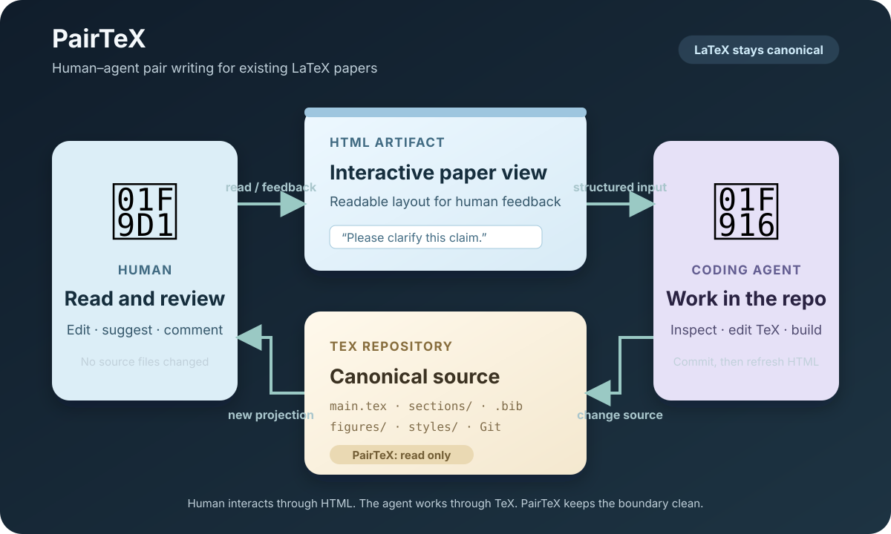
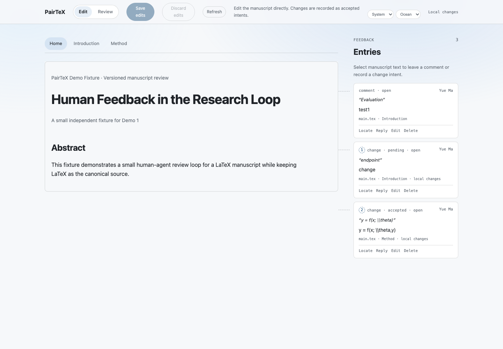

# PairTeX

Human-agent pair writing for existing LaTeX papers.

PairTeX renders an existing LaTeX repository as a readable, interactive local
HTML view. Humans can edit supported prose/math, propose changes, and leave
comments. PairTeX stores those actions as feedback artifacts; it never edits
`.tex`, `.bib`, figures, or other canonical source files. LaTeX remains the
single source of truth, while HTML is disposable.

PairTeX is deterministic and does not require an LLM, model API, or agent
runtime.

PairTeX is intentionally tiny and hot-pluggable: point it at an existing
LaTeX project, start a local view, and unplug it at any time. No project
restructuring, source migration, new editor, or replacement build workflow is
required.

## Where PairTeX fits

[Prism](https://openai.com/prism/) and [Overleaf](https://www.overleaf.com/)
are complete online writing workspaces. PairTeX is deliberately a different
layer: a tiny local adapter and feedback protocol for projects that already
have a LaTeX repository, build workflow, Git history, and coding agent.

| | Prism | Overleaf | PairTeX |
| --- | --- | --- | --- |
| Product shape | Cloud AI-native writing workspace | Online collaborative LaTeX workspace | Lightweight local plug-in layer |
| Canonical work | Prism project | Overleaf project | Existing Git + LaTeX repository |
| Human interface | Integrated editor and AI assistant | Editor, comments, and track changes | Disposable interactive HTML projection |
| Agent interface | Built-in AI inside the workspace | Workspace and optional Git integrations | Any coding agent consumes portable feedback artifacts |
| Git relationship | Git integration is currently unavailable | Git/GitHub integrations are available for eligible plans | Git-native by design |
| Source boundary | Workspace manages project edits | Workspace manages project edits | PairTeX is read-only; `.tex` / `.bib` remain canonical |
| AI dependency | Built-in AI | Not required for core editing | No LLM or model API required |

### Use PairTeX when

* the paper already lives in a local Git repository;
* the existing compiler, templates, macros, and build scripts must stay intact;
* humans want a comfortable HTML reading/review surface without moving the
  project into another workspace;
* the team wants to choose its own coding agent;
* feedback should be local, auditable, commit-aware, and portable;
* PairTeX must be removable without changing the manuscript project.

PairTeX is not a replacement for Prism, Overleaf, or a coding agent. Its
advantage is composability: it adds the missing human-facing review layer and
agent handoff while leaving the user's source, tools, and ownership model
alone.

Prism currently supports importing LaTeX projects, but its [official help
documentation](https://help.openai.com/en/articles/20001050-troubleshooting-and-getting-help-in-prism)
says that Git integration is not yet available. Overleaf documents Git and
GitHub synchronization as integrations for eligible plans; PairTeX is Git-native
without moving the project into a separate workspace.

<p align="center">
  
</p>

PairTeX gives humans a comfortable manuscript surface while coding agents keep
working in the repository they already understand. The HTML layer and feedback
files are disposable/plugin-owned artifacts; the original TeX project stays
clean and read-only from PairTeX's perspective.

The demo below shows the complete human-facing surface. Humans work in the
HTML artifact; PairTeX records their actions as independent feedback artifacts
under `.pairtex/feedback/`. Comments remain comments, while Edit and Review
produce structured change entries. Each card can be located in the manuscript,
replied to, edited, or deleted. The coding agent decides how to consume the
entries and whether to resolve them after changing the canonical TeX.

<p align="center">
  
</p>

## Quick start

Point PairTeX at an existing project and an already rendered HTML file:

```sh
python3 pairtex.py \
  --project /path/to/paper \
  --html /tmp/pairtex-rendered/main.html \
  --port 8765
```

Open <http://127.0.0.1:8765/>. PairTeX writes feedback to independent files
under `/path/to/paper/.pairtex/feedback/` and does not modify the manuscript.

Each user may run PairTeX with their own temporary HTML projection. PairTeX
does not synchronize those projections.

## Public demos

### Minimal interaction demo

```sh
python3 pairtex.py \
  --project demo/fixture \
  --html demo/fixture/rendered.html \
  --port 8765
```

This isolated fixture demonstrates comments, Edit/Review modes, formula
editing, feedback persistence, threads, and section navigation. It does not
depend on the private SIDERIUS paper.

### Conference-template demos

The repository includes the same synthetic paper in public ICLR, NeurIPS, and
ICML wrappers:

```sh
python3 pairtex_render.py \
  --project demo/iclr \
  --input main.tex \
  --output /tmp/pairtex-iclr-rendered \
  --build-command 'latexmk -pdf -interaction=nonstopmode -halt-on-error {input}'

python3 pairtex.py \
  --project demo/iclr \
  --html /tmp/pairtex-iclr-rendered/main.html \
  --port 8766
```

The equivalent projects are `demo/neurips/` and `demo/icml/`. They test
formulas, citations, figures, tables, sections, subsections, and different
conference styles without using SIDERIUS content.

## Human-agent workflow

One canonical TeX source commit is one collaboration turn. The complete loop is:

### 1. Ask the agent to start PairTeX

Send this prompt from the LaTeX repository:

```text
Read and follow skills/pairtex-agent/SKILL.md. Use PairTeX to render this existing LaTeX repository into a disposable local HTML projection. Discover the manuscript entry point and use the repository's existing build workflow. Do not modify any canonical source files. Start the PairTeX localhost view and report the URL, source HEAD commit, dirty state, render command, and HTML output path.
```

If the agent does not already have this skill available, provide it from this
repository or install it in that agent's skill directory before sending the
prompt.

The agent should only build/render and start the local view. Open the reported
URL and use the HTML interface to add comments, Edit-mode changes, or
Review-mode proposals. PairTeX writes them to `.pairtex/feedback/`.

### 2. Ask the agent to consume the feedback

After finishing your feedback, send:

```text
Read and follow skills/pairtex-agent/SKILL.md. Consume the open PairTeX feedback in .pairtex/feedback/. For each entry, use its commit and redundant source anchors to inspect the current repository, apply appropriate changes only to canonical source, and preserve existing project conventions. Build the paper and regenerate the PairTeX HTML projection. Resolve only feedback that is actually addressed; for anything ambiguous or intentionally deferred, leave it open and append a concise thread reply. Report the source diff, build result, render path, and feedback decisions.
```

The agent may modify only the canonical source as part of this step. It should
not resolve feedback speculatively. A comment can result in a source edit, a
question in the thread, or an explained decision not to edit. An Edit-mode
change is already accepted as human intent; a Review-mode change remains a
proposal until the agent decides how to handle it.

### 3. Refresh the browser

When the agent reports that it has regenerated the HTML, click `Refresh` in the
PairTeX page. The page rereads the latest HTML and feedback files. It does not
compile TeX or modify source.

The agent should commit the canonical source change at the end of the turn,
then record that source commit in the resolution metadata. Feedback metadata
may be committed separately for Git exchange. If an item is not addressed, it
stays open and receives a thread reply.

For the full schema, anchor rules, lifecycle semantics, thread format, and
agent boundaries, read
[`skills/pairtex-agent/SKILL.md`](skills/pairtex-agent/SKILL.md).

## Renderer adapters

The default renderer is `make4ht`, but rendering is replaceable. Use
`--adapter-command` to provide an external adapter; see
[`docs/renderer-adapters.md`](docs/renderer-adapters.md).

The adapter runs against a disposable project copy. PairTeX validates and
publishes the HTML projection but never changes the target source to make a
renderer work.

## Project boundary

PairTeX is a clean drop-in layer, not an IDE or Overleaf replacement. It does
not provide a compiler, source editor, bibliography manager, agent framework,
LLM integration, CRDT collaboration, or HTML-to-LaTeX rewriting system.
